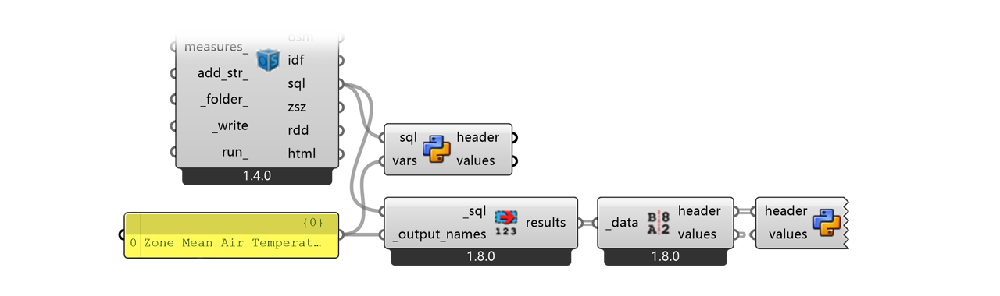
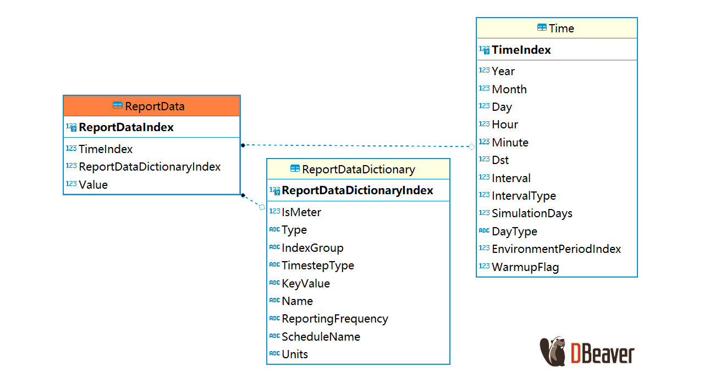

`Python 2.7` `LadybugTools 1.8.0`

## Write CSV in Honeybee workflow



There are some complaints about the inconvenience of `HB Model To OSM` module in Honeybee for its incapability to output CSV format of variables, neither you can find such CSV file in the batch simulation folder of EnergyPlus (because HB simply does not run the CSV conversion batch). However, you can append a simple Python block to the HB workflow to write down the data yourself:

```python
"""
Inputs:
    header: list of ladybug.header.Header object / List access
    values: datatree rooted at {0;0;0} / Tree access
"""
__version__ = "2025.01.01"
import re, csv
import ghpythonlib.treehelpers as th

# Line breaks \n and \r will sabotage the CSV format
tags = [x.ToString().replace('\n', ' ').replace('\r', '') for x in header]
# The layer of th.tree_to_list() depends on the branch path {0;0;0}
values_nested = th.tree_to_list(values)[0]
pattern = r'ROOM_(\d+)_\w{8}'
headers_ = sorted(
    [s for s in tags if re.search(pattern, s)],
    key=lambda x: int(re.search(pattern, x).group(1))  # Get the room index
)
values_ = [values_nested[tags.index(x)] for x in headers_]

# Use open('$PATH', 'w', newline='') for Python3. here's for Python2:
with open('C:\users\ianqu\desktop\data.csv', 'wb') as file:
    writer = csv.writer(file, delimiter=',')
    writer.writerow(["Time Step"] + headers_)
    for i in range(len(values_[0])):
        writer.writerow([str(i)] + [str(series[i]) for series in values_])
```

You can directly take the output from `LB Deconstruct Data` but do note that the header string contains line breaks so you need to remove them before CSV serialization. The header generated by HB looks like below. By default, HB name each zone by *name prefix* + *index* + *8-digit GUID*. The name prefix is defined by component `HB Room from Solid` or just ROOM by default. The index increases each time you define a new room in current canvas. In SQL, all zones are ordered alphabetically by their name strings, so the sequence may not be ideal and you need to reorder them by their index number.

```
Temperature (C)
7/1 to 7/30 between 0 and 23 @1
Zone: ROOM_48_1562C3FF
type: Zone Mean Air Temperature
```

## Decode SQLite

One step further, since EnergyPlus outputs everything in an SQLite file, we can read it out directly if you are familiar with SQL language. For example, customize the following component with SQL path output wired in, to get rid of `HB Read Custom Result` and `LB Deconstruct Data`

```python
""" 
Inputs:  
    sql: The path to the SQLite database / Item access
    vars: The name of output variable / List access
Output:
    header: List of keys for time series
    values: Datatree of time series data
"""
__version__ = "2025.01.01"
import sqlite3
import re, os, csv
import ghpythonlib.treehelpers as th

conn = sqlite3.connect(sql)
cursor = conn.cursor()
query = """
    SELECT dict.KeyValue, vals.Value
    FROM ReportDataDictionary dict
    JOIN ReportData vals ON dict.ReportDataDictionaryIndex = vals.ReportDataDictionaryIndex
    JOIN Time ON Time.TimeIndex = vals.TimeIndex
    WHERE dict.Name IN ({});
    """.format(', '.join('?' for _ in vars))
cursor.execute(query, vars)
results = cursor.fetchall()
conn.close()
val_dict = {}
for row in results:
    if row[0] in val_dict:
        val_dict[row[0]].append(row[1])
    else:
        val_dict[row[0]] = [row[1]]
        
# Equal outputs with LadybugTools component
header = val_dict.keys()
values = th.list_to_tree(val_dict.values())

# or, directly output as csv
pattern = r'ROOM_(\d+)_\w{8}'
headers_ = sorted(
    [s for s in val_dict.keys() if re.search(pattern, s)],
    key=lambda x: int(re.search(pattern, x).group(1))  # Get the room index
)

values_ = [val_dict[x] for x in headers_]
filename = os.path.dirname(ghdoc.Path) + '\data.csv'
with open(filename, 'wb') as file:
    writer = csv.writer(file, delimiter=',')
    writer.writerow(["Time Step"] + headers_)
    for i in range(len(values_[0])):
        writer.writerow([str(i)] + [str(series[i]) for series in values_])
```

`cursor.execute(query, vars)` will replace `?` in the first argument `query` string one by one, according to the item in the second argument `vars`.  The second argument can be a list of strings, or a tuple with the first item as a string and the second left blank. Check SQL language for more details. For example if you only have one variable to retrieve:

```
vars = ['Zone Mean Air Temperature']
vars = (['Zone Mean Air Temperature',)
```

## Inside eplusout.sql



All data requested by IDF `Output:Varialbes` will be stored in 3 SQL tables: `ReportDataDictionaryIndex` binds each variable with an id, `ReportData` binds variable id with its value and the simulation step id, `Time` relates all step ids with time stamps. So basically you can retrieve any `{VarName}` of any `{ZoneName}` by following query: (replace { })

```mysql
SELECT vals.Value
FROM ReportDataDictionary dict
JOIN ReportData vals ON dict.ReportDataDictionaryIndex = vals.ReportDataDictionaryIndex
JOIN Time ON Time.TimeIndex = vals.TimeIndex
WHERE dict.Name = '{VarName}' AND dict.KeyValue = '{ZoneName}';
```

## Notes

For simplicity, this code block only shows how to export a CSV matrix for space-time variance of indoor temperature. Variables packed in CSV file can be easily analyzed using Python tools. Note these when customizing your own component:
- Python 2 or 3? Grasshopper is based on IronPython under Python2, so there can be minor difference in CSV serialization and string format. However, Grasshopper 2.0 with Rhino 8 implements Python3 right now
- Local package? If analysis is needed inside the Grasshopper environment with local packages such as Numpy or Pandas, consider CPython plugin
- Zone name pattern? I use `ROOM_(\d+)_\w{8}` as default to get all default rooms. Crack your own regex pattern for more complicated matching
- CSV path? `os.path.dirname(ghdoc.Path)` returns the directory path of current GH file. Use absolute path will be more convenient