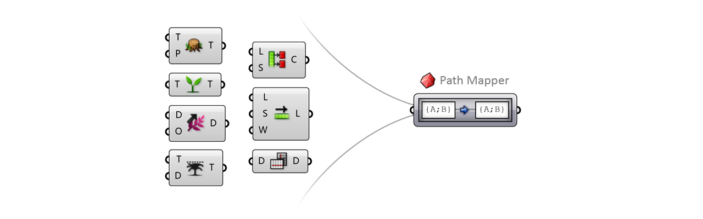
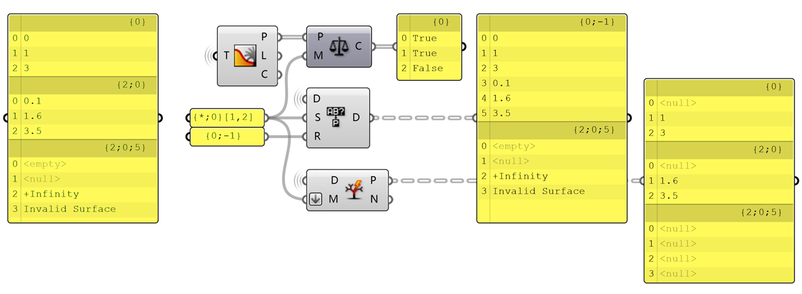
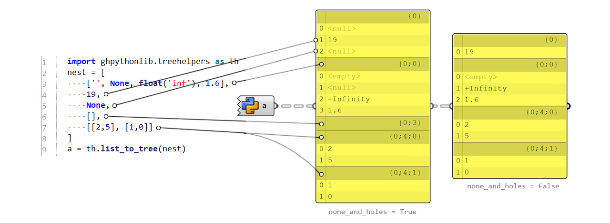

## General

By convention, a 2D matrix can be expressed as a `{0;X}` structured data tree (read out a CSV and split it with `,` to get it), and the first digit of path implies that all data grows on the same tree. While, `{X}` usually represents a forest.  

## Path Mapper



As the name implies, `Path Mapper` is a function that does 1-1 path mapping for each item in a tree thus reorganizing the structure. It does not populate or eliminate any item.  
It can be a supersession for `Flatten`, `Graft`, `Shift` and `Trim`. A bit rigid thing is that the pattern you define is NOT dynamic, which means your mapper will no longer work if your data structure changes. So, it cannot fully replace these components essentially. (To make it dynamic? Check this C# parasite [@Mahdiyar](https://discourse.mcneel.com/t/path-mapper-with-variable-input/97740/4))  
Here are basic mapping relations. Note that `(i)` marks the index of item within each branch, which can be ignored if not contributing to the path.  

```bash
{A;B;C} => {0} 			// flatten
{A;B;C}(i) => {A;B;C;i} // graft
{A;B;C} => {path_index} // renumber branches
{A;B;C} => {A;B;C}		//  0 shift path
{A;B;C} => {A;B} 		// -1 shift path = +1 trim tree
{A;B;C} => {A} 			// -2 shift path = +2 trim tree
{A;B;C} => {B;C} 		// +1 shift path
{A;B;C} => {C} 			// +2 shift paht
```

It can also replace `Flip Matrix` component, with more abilities.  Note that `path_count` return the total number of branches thus not working for matrix with higher dimension. However, you can reshape it just like `numpy.transpose()` does, by reordering path placeholders.  

```
{0;B}(i) => {0;B}(item_count - 1 - i)	// horizontal flip
{0;B}(i) => {0;path_count - 1}(i)		// vertical flip
{0;B}(i) => {0;i}(B)					// diagonal flip = np.transpose(1,0)
{0;B;C}(i) => {0;i;B}(C)				// reshape matrix = np.transpose(2,0,1)
```

It can function as `Partition List` or `Shift List` component by index operations. Check examples below. See the last one, weird huh? Because it maps every item at (i) to (0) and override it iteratively, the resulting data tree only records the last item of every branch. None the less, it is totally off the point.

```
{0}(i) => {0;i\5}					// partition list by size 5
{0}(i) => {0;i%5}					// pick every 5th item
{0}(i) => {0}(item_count - 1 - i)	// reverse list
{0}(i) => {0}((i - 1) % item_count) // +1 shift list
{A;B}(i) => {A;B}(0)				// last item of each branch list
```

`Path Mapper` supports multiline rules to achieve 1-n or n-1 mappings, though that is not what it is designed for. You can easily duplicate a list into different paths (similar to `Duplicate Data` component). 

```
┌ {0}(i) => {0}(2 * i)				// Duplicate Data (Order? false)
└ {0}(i) => {0}(2 * i + 1)			// {0,1,2} into {0,0,1,1,2,2}
┌ {0} => {0}						// Duplicate Data (Order? true)
└ {0} => {0}						// {0,1,2} into {0,1,2,0,1,2}
```

## Path Mask

The path mask looks like `{}[]` nesting the selection rules [@David](https://www.grasshopper3d.com/forum/topics/datatree-selection-rules). Here are basic instructions to crack it.

```
{;}			// match path with semicolon as level separator
[,]			// match data with comma as AND operator
*			// wildcard for any number or path pattern
?			// wildcard for a single integer (in data or path)
6			// specific integer as index (non-int will be rounded)
!			// NEGATION operator
or			// OR operator
and			// AND operator
()			// combine pattern expressions
1 to 3		// match index within a range
1,3,...		// match index following a certain sequence
< 4			// shorthand for range 0 to 3
```



`Path Compare` works with path only so `[,]` filter does not work. It checks whether a path satisfies certain masks.

`Replace Paths` works with path and data but only considers `{;}` filters. The 'search mask' and the 'replacement path' must be a 1-1 pair. If a certain branch satisfies the mask, it will modify the structure of that branch and leave the others untouched. You can take it as a supersession to `Path Mapper`, which regards the 1-1 mapping relation as the paired input 'search mask - replacement path'.

`Split Tree` dispatches data in a tree according to the mask, so `{;}` and `[,]` both work. When your mask only has `{;}` filter, it forwards branches either to YES or NO output; when your mask includes `[,]` filter, it forwards all branches to both YES and NO outputs, but with data selected according to the mask.

Tips:
- The mask only takes integer. You can force it to be a float number as it will be rounded anyway: 0.2 -> 0, 1.6 -> 2, . -> 0 
- With multiple masks input, `Path Compare` acts quite weird????????????

## in GhPython Script

By `ghpythonlib.treehelpers` you can interoperate Grasshopper tree with Python list:

```python
import ghpythonlib.treehelpers as th
_list = th.tree_to_list(tree)
_tree = th.list_to_tree(_list)
```

 Inside the box are following codes [@Giulio](https://gist.github.com/piac/ef91ac83cb5ee92a1294?permalink_comment_id=3887230)

```python
def tree_to_list(input, retrieve_base = lambda x: x[0]): 
    """Returns a list representation of a Grasshopper DataTree""" 
	def extend_at(path, index, simple_input, rest_list): 
		target = path[index] 
		if len(rest_list) <= target: 
			rest_list.extend([None]*(target-len(rest_list)+1)) 
		if index == path.Length - 1: 
			rest_list[target] = list(simple_input) 
		else: 
			if rest_list[target] is None: rest_list[target] = [] 
			extend_at(path, index+1, simple_input, rest_list[target]) 
	all = [] 
	for i in range(input.BranchCount): 
		path = input.Path(i) 
		extend_at(path, 0, input.Branch(path), all) 
	return retrieve_base(all)
```

```python
def list_to_tree(input, none_and_holes=True, source=[0]):
    """Transforms nestings of lists or tuples to a Grasshopper DataTree"""
    from Grasshopper import DataTree as Tree
    from Grasshopper.Kernel.Data import GH_Path as Path
    from System import Array
    def proc(input,tree,track):
        path = Path(Array[int](track))
        if len(input) == 0 and none_and_holes: tree.EnsurePath(path); return
        for i,item in enumerate(input):
            if hasattr(item, '__iter__'): #if list or tuple
                track.append(i); proc(item,tree,track); track.pop()
            else:
                if none_and_holes: tree.Insert(item,path,i)
                elif item is not None: tree.Add(item,path)
    if input is not None: t=Tree[object]();proc(input,t,source[:]);return t
```

Tips:
- `tree_to_list()` does not support path including negative index
- `tree_to_list()` iterates from 0 even though that branch has no data. For example, the tree `{0:2}` will be explained as `[None, None, []]`. In these case, you may need to remove those `None` values afterwards.
-  `retrieve_base` marks on what tree level you'd like to expand the branches into list. Some tree can be simplified, where all branches share the same part of path, thus creating redundant nested layers. In essence, it just allows you to pick any item inside the output nested list, so there is no need to modify this argument.
- `none_and_holes` defines whether `None` or `[]` empty list should be put in the tree. If toggled True, the tree will include: 1. `<null>` valued data filling up jumping index and representing the `None` value; 2. empty branch representing an empty list `[]`.
- `source` defines on what path you'd like to graft the tree. By default, a tree starts from path `{0}` and appends branches behind. If you set it as `source=[]`, each nested sublist will form a tree themselves thus creating a forest. Confused, hun? Check the examples below.
- Data will be overwritten due to conflict `{*;i}` -override-> `{*}(i)`. You should check the data structure before such conversion.

```
retrieve_base = lambda x: x 		{A}(i)		-> [[i]]
retrieve_base = lambda x: x[0] 		{0;A}(i)	-> [[i]]		{0}(i)	-> [i]
retrieve_base = lambda x: x[0][2] 	{0;2;A}(i)	-> [[i]]		{0;2}(i)-> [i]
source = []							[[i]]		-> {A}(i)
source = [0]						[[i]]		-> {0;A}(i)
source = [2,-1]						[[i]]		-> {2;-1;A}(i)
```



In this example:  
`nest[0]` takes path `{0;0}` thus leaving a *hole* in path `{0}(0)`. The hole will be a `<null>` by default. Reversely, if you convert such a tree back to list, any data at path `{0}(0)` will be overwritten due to the existence of any path like `{0;*}`  
`nest[2]` takes path `{0}(2)`. `None` value in Python converted to `<null>` in C#  
`nest[3]` empty list converted to empty branch at path `{0;3}`  
`nest[4]` has sublists, which expands further at path `{0;4;0}` and `{0;4;1}`  

## in C# Script

```csharp
DataTree<T> ListToTree<T>(List<List<T>> list)
{
    DataTree<T> tree = new DataTree<T>();
    for (int i = 0; i < list.Count; i++)
        tree.AddRange(list[i], new GH_Path(new int[]{0,i}));
    return tree;
}
```

```csharp
List<List<T>> TreeToList<T>(DataTree<T> tree)
{
    List<List<T>> list = new List<List<T>>();
    for (int i = 0; i < tree.BranchCount; i++)
        list.Add(tree.Branch(new GH_Path(new int[]{0,i})));
    return list;
}
```

To its essence, the data tree in Grasshopper acts more like `Dictionary<GH_Path,List<T>>`. It is more straightforward to manipulate a tree branch than a converted list. `GH_Path()` takes an integer array to formulate the key directing to the branch. Array [0, 0, 1] corresponds to the path {0; 0; 1}. Thus, you can add elements to a list just like a dictionary. See below.

```csharp
GH_Path()					// create path {0}
GH_Path(0,0,1)				// create path {0;0;1}
GH_Path(new int[]{0,0,1})	// create path {0;0;1}

tree.Add(1, new GH_Path())
tree.AddRange(new List<int>() {1, 2}, new GH_Path())
tree.RemovePath(i);			// clear the data but keep the branch
tree.RenumberPaths();		// reorder to prune the branch
tree.Branch(i);				// retrieve branch data as a list
```

Working with dynamic depth nested lists is not a good idea... Although you can dig further about it: [DataTree to List of Lists (dynamic depth) c#](https://discourse.mcneel.com/t/datatree-to-list-of-lists-dynamic-depth-c/61830)


## in C# Addin...

`DataTree<T>` is a simplified version of `GH_Structure<T>` that demands `T` implement the `IGH_Goo` interface. C# environment does not welcome such types so you have to convert it first such as `GH_Integer` to `int` in the following case:

```csharp
using Grasshopper.Kernel;       // GH_Component
using Grasshopper.Kernel.Data;  // GH_Structure
using Grasshopper.Kernel.Types; // GH_Integer
using System.Linq;

public class YourModule : GH_Component
{
    public YourModule() : base("Name", "Abbr.", "Desc.", "Ribbon", "Tab") {}
    protected override void RegisterInputParams(
	    GH_Component.GH_InputParamManager pManager)
    {
        pManager.AddIntegerParameter("Input", "in", "Desc.", GH_ParamAccess.tree);
    }
    protected override void RegisterOutputParams(
	    GH_Component.GH_OutputParamManager pManager)
    {
        pManager.AddIntegerParameter("Output", "out", "Desc.", GH_ParamAccess.tree);
    }
    protected override void SolveInstance(IGH_DataAccess DA)
    {
        // parse input datatree
        GH_Structure<GH_Integer> id_tree = new GH_Structure<GH_Integer>() { };
        if (!DA.GetDataTree(0, out id_tree)) return;
        // decode GH_Integer tree to int list with Linq
        List<List<int>> id_list = new List<List<int>>();
        foreach (var branch in id_tree.Branches)
            id_list.Add(branch.Select(s => s.Value).ToList());
		// parse output datatree
        DA.SetDataTree(0, ListToTree(id_list));
    }
}
```

